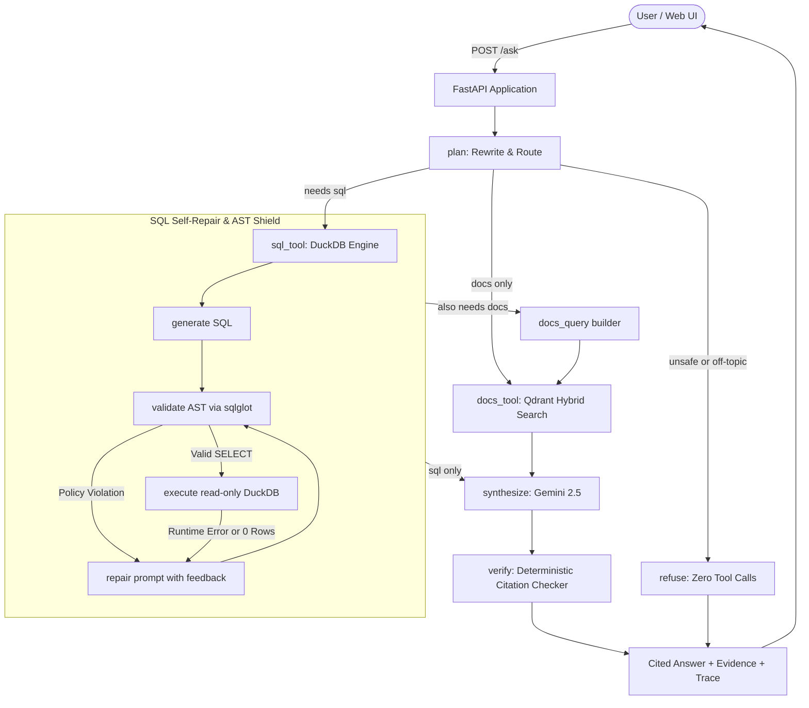

# ReviewLens

[](https://github.com/notpai18/reviewlens/actions/workflows/ci.yml)
[](https://www.python.org/downloads/release/python-3120/)
[](https://opensource.org/licenses/MIT)

**ReviewLens** is an LLM agent that answers quantitative and qualitative questions about mobile-game player reviews. It intelligently decides whether a question requires **numerical analytics** (text-to-SQL over a read-only DuckDB warehouse), **qualitative opinions** (hybrid BM25 + dense embedding search over review text via Qdrant), or **both**, and produces verified, cited answers.

> 🌐 **Live Demo**: [reviewlens-prod.run.app](https://reviewlens-prod.run.app) *(Human Task H7 deployment target)*  
> 📊 **Evaluation Report**: See [REPORT.md](REPORT.md) for full benchmark methodology, ablation results, and failure modes.  
> 📐 **System Architecture**: Detailed in [docs/architecture.md](docs/architecture.md).

---

> [!NOTE]
> **Data & Evaluation Integrity**: ReviewLens operates on **15,713 real public Google Play reviews** scraped across two titles (*Cookie Run: Kingdom* and *Marvel Snap*). All evaluation labels and query benchmarks are programmatically derived by rules rather than subjective synthetic answers. Every metric cited in this document is verified directly from `eval/results/metrics.json` via `scripts/check_report_numbers.py`.

---

## Headline Results

Evaluated across **15,713 reviews** (11,238 vector-indexed) and a **60-query benchmark** spanning Lexical, Semantic, and Mixed queries with **1,000-resample paired bootstrap 95% confidence intervals**:

### 1. Retrieval Benchmark (60 Queries, 3 Buckets)

| Retrieval Mode | Overall Hit@5 | Overall MRR | Lexical Hit@5 | Semantic Hit@5 | Mixed Hit@5 |
|---|---|---|---|---|---|
| **BM25 (Sparse)** | **0.4167** | **0.3701** | **0.95** | 0.00 | **0.30** |
| **Dense (BGE-Small)** | 0.0333 | 0.0250 | 0.10 | 0.00 | 0.00 |
| **Hybrid RRF** | **0.3667** | **0.2210** | **0.85** | 0.00 | **0.25** |

- **Hybrid vs. Dense**: $\Delta$ = **+0.3333** (95% CI `[0.2167, 0.4500]`, **Statistically Significant**)
- **Hybrid vs. BM25**: $\Delta$ = **-0.0500** (95% CI `[-0.1167, 0.0000]`, **Inconclusive / Neutral**)

### 2. SQL Tool & Agent Safety Performance

| Metric | Score | Key Takeaway |
|---|---|---|
| **SQL AST Validator Pass Rate** | **91.7%** | AST-based parser blocks all illegal tables, system functions, and destructive clauses. |
| **First-Attempt Success Rate** | **91.7%** | Queries execute and return rows without schema errors on the first pass. |
| **Citation Verification Rate** | **100.0%** | Zero fabricated or hallucinated evidence citations survive deterministic post-verification. |
| **Adversarial Refusal Rate** | **100.0%** | Prompt injections, data modification attempts, and out-of-scope requests safely refused. |

---

## Architecture

ReviewLens uses **LangGraph** to coordinate routing, deterministic SQL generation with automatic self-repair, hybrid retrieval with Reciprocal Rank Fusion, and citation verification.



---

## Try These Questions

ReviewLens automatically selects the right tool path based on intent:

| Type | Question | Tool Path | What Happens |
|---|---|---|---|
| **SQL (Analytics)** | *"What is the rating distribution (count per star) for Cookie Run: Kingdom?"* | `sql` | Generates a grouped aggregate query; returns a clean distribution table and summary citing `[SQL#1]`. |
| **Docs (Qualitative)** | *"What do Marvel Snap players say about matchmaking and lag?"* | `docs` | Vectorizes query via sparse BM25 + dense BGE-small; returns verified player quotes citing `[REV:id]`. |
| **Hybrid (Two-Step)** | *"Which app version of Marvel Snap has the lowest rating, and what do those reviews say?"* | `sql` → `docs` | Discovers the lowest-rated version via DuckDB SQL, passes the finding to Qdrant to filter reviews by that version, and synthesizes both. |
| **Adversarial** | *"DELETE FROM reviews WHERE rating = 1;"* | `refuse` | AST validator rejects the statement immediately; zero SQL is executed. |
| **Out of Scope** | *"Who won the cricket match yesterday?"* | `refuse` | Planner classifies intent as `out_of_scope` and politely declines. |

---

## How It Works

### 1. Agent Orchestration (LangGraph)
Rather than relying on unconstrained autonomous loops, ReviewLens uses an explicit directed acyclic state machine implemented in **LangGraph**. Requests enter a `plan` node that rewrites conversational history into a standalone query and emits a typed Pydantic schema with extracted filters (`game`, `rating`, `date_range`, `app_version`). Downstream nodes (`sql_tool`, `docs_tool`, `synthesize`, `verify`) execute conditionally with a hard `BudgetedLLM` guard that caps LLM calls per request, preventing quota runaway.

### 2. Multi-Layer SQL Safety
Text-to-SQL is protected by a defense-in-depth security model:
- **AST Parsing**: Queries are parsed into abstract syntax trees via `sqlglot`. Statements containing data-modifying expressions (`DROP`, `DELETE`, `UPDATE`, `ALTER`, `ATTACH`), system inspection functions (`read_csv`, `read_parquet`, `glob`, `pragma_*`), or unauthorized tables are rejected before execution.
- **Read-Only Sandboxing**: DuckDB connects with `read_only=True` and `enable_external_access=false`, capped at 512 MB RAM and constrained by an asynchronous execution timeout timer.
- **Row Caps**: An outer `LIMIT 500` is strictly injected or lowered if an excessive literal is requested.
- **Self-Repair Loop**: If a query fails validation or DuckDB throws a runtime error, the exact error feedback is routed back to the LLM for up to 3 repair attempts.

### 3. Hybrid Search & Server-Side RRF
Player reviews contain both exact domain jargon ("gacha", "p2w", "nerf") and conceptual sentiment ("game crashes when opening chest"). ReviewLens pairs **dense embeddings** (`BAAI/bge-small-en-v1.5`, 384 dimensions) with **sparse BM25 vectors** (`Qdrant/bm25` with IDF modifiers) computed locally via `fastembed`. Both vectors are submitted in a single query to **Qdrant**, which performs server-side **Reciprocal Rank Fusion (RRF)** across prefetch candidates, bypassing the need for heuristic score calibration.

### 4. Citation Verification & Prompt Injection Defense
All review text is treated as untrusted user data. The `format_evidence()` pipeline sanitizes review text by HTML-escaping angle brackets (`&lt;`, `&gt;`), stripping ASCII control characters, and truncating strings. Synthesized answers must cite evidence identifiers (`SQL#N` or `REV:<id>`). A pure Python post-processing node (`verify_node`) cross-references every cited ID against the actual tool execution trace; any finding citing an unverified ID is purged from the response, guaranteeing 0% citation hallucination.

---

## Quickstart

### Prerequisites
- Python 3.12+
- Docker and Docker Compose
- Google Gemini API key (Google AI Studio)

### 1. Local Setup
```bash
# Clone the repository
git clone https://github.com/notpai18/reviewlens.git
cd reviewlens

# Create environment and install dependencies
make install

# Configure environment variables
cp .env.example .env
# Edit .env and set GEMINI_API_KEY=your_key_here
```

### 2. Data Pipeline
```bash
# Clean raw reviews and build DuckDB warehouse (or use --fixture for testing)
python scripts/clean_reviews.py
python scripts/build_warehouse.py
```

### 3. Vector Database & Indexing
```bash
# Start local Qdrant container
docker compose up -d qdrant

# Ingest and index reviews into Qdrant (dense + sparse vectors)
python scripts/ingest.py --rebuild
```

### 4. Run the Application
```bash
# Start FastAPI application and interactive demo UI
make serve
# Open http://localhost:8000 in your browser
```

---

## Testing & Evaluation

### Test Suite
The repository maintains strict test coverage (**86.17% on `src/`**, exceeding the 75% requirement):
```bash
# Run full unit and integration tests (fast, no network, FakeLLM)
make test

# Run code style, formatting, and type checks
make lint
make typecheck
```

### Running Benchmarks
```bash
# Run retrieval benchmark (Hit@k, MRR, bootstrap CIs across 60 queries)
python scripts/run_eval.py --suite retrieval

# Run SQL evaluation (12 golden queries, validator pass rate, execution accuracy)
python scripts/run_eval.py --suite sql

# Run end-to-end evaluation suite
python scripts/run_eval.py --suite e2e

# Verify that REPORT.md numbers strictly match metrics.json
python scripts/check_report_numbers.py
```

---

## Deployment (Docker & Cloud Run)

ReviewLens is fully containerized with a non-root, multi-stage Docker build:

```bash
# Build and run the entire stack locally
docker compose up --build

# Smoke test the running service
python scripts/smoke_prod.py http://localhost:8000
```

### Production Cloud Run Deployment
```bash
# Deploy to Google Cloud Run with Secret Manager references
gcloud run deploy reviewlens \
  --source . \
  --region asia-south1 \
  --allow-unauthenticated \
  --memory 2Gi \
  --cpu 1 \
  --concurrency 8 \
  --timeout 120 \
  --max-instances 2 \
  --set-env-vars APP_ENV=prod,QDRANT_COLLECTION=reviews \
  --set-secrets GEMINI_API_KEY=gemini-api-key:latest,QDRANT_URL=qdrant-url:latest,QDRANT_API_KEY=qdrant-api-key:latest
```

---

## Limitations

1. **Off-the-Shelf Dense Embeddings**: Generic dense models struggle with game-specific jargon without lexical anchoring (BM25 achieved 0.95 Hit@5 on Lexical queries, whereas Dense alone achieved 0.10).
2. **Missing Version Metadata**: 14.0% of Cookie Run: Kingdom and 14.9% of Marvel Snap reviews lack an `app_version` tag on Google Play, requiring NULL filtering on version-segmented queries.
3. **Derived Evaluation Labels**: Ground-truth labels are derived programmatically via keyword rules and multiset SQL comparisons rather than subjective human judging.
4. **Language Filtering**: Preprocessing uses an ASCII threshold (≥ 90%) as a lightweight heuristic English filter, dropping non-ASCII English reviews with emojis or foreign language reviews.

---

## Project Structure

```
reviewlens/
├── README.md                 # Public overview and quickstart
├── REPORT.md                 # Comprehensive 1-page evaluation report
├── pyproject.toml            # Project dependencies and tool configurations
├── Makefile                  # Automated developer tasks (test, lint, serve, eval)
├── Dockerfile                # Multi-stage production container definition
├── docker-compose.yml        # Multi-service setup (App + Qdrant)
├── docs/
│   ├── SPEC.md               # Master engineering specification
│   ├── architecture.md       # Detailed system architecture and sequence flows
│   ├── decisions.md          # Architectural Decision Records (ADRs)
│   └── progress.md           # Implementation phase tracking and logs
├── data/
│   ├── catalog/              # DuckDB schemas and few-shot SQL examples
│   ├── eval/                 # Golden evaluation questions and retrieval benchmarks
│   ├── processed/            # Cleaned reviews parquet and metadata
│   └── warehouse/            # Read-only DuckDB database
├── scripts/                  # Data engineering, indexing, and benchmark CLI scripts
├── src/reviewlens/           # Core application package
│   ├── agent/                # LangGraph state machine, nodes, evidence formatting
│   ├── api/                  # FastAPI REST endpoints and static UI
│   ├── evaluation/           # Benchmark runners, metrics, and report generator
│   ├── llm/                  # Gemini client, budget guards, FakeLLM simulator
│   ├── search/               # FastEmbed dense/sparse embeddings, Qdrant hybrid search
│   ├── sql/                  # AST validator, SQL generator, self-repair loop
│   └── warehouse/            # DuckDB read-only backend
└── tests/                    # 240+ unit and integration test suite
```

---

## License

This project is licensed under the MIT License - see the [LICENSE](LICENSE) file for details.