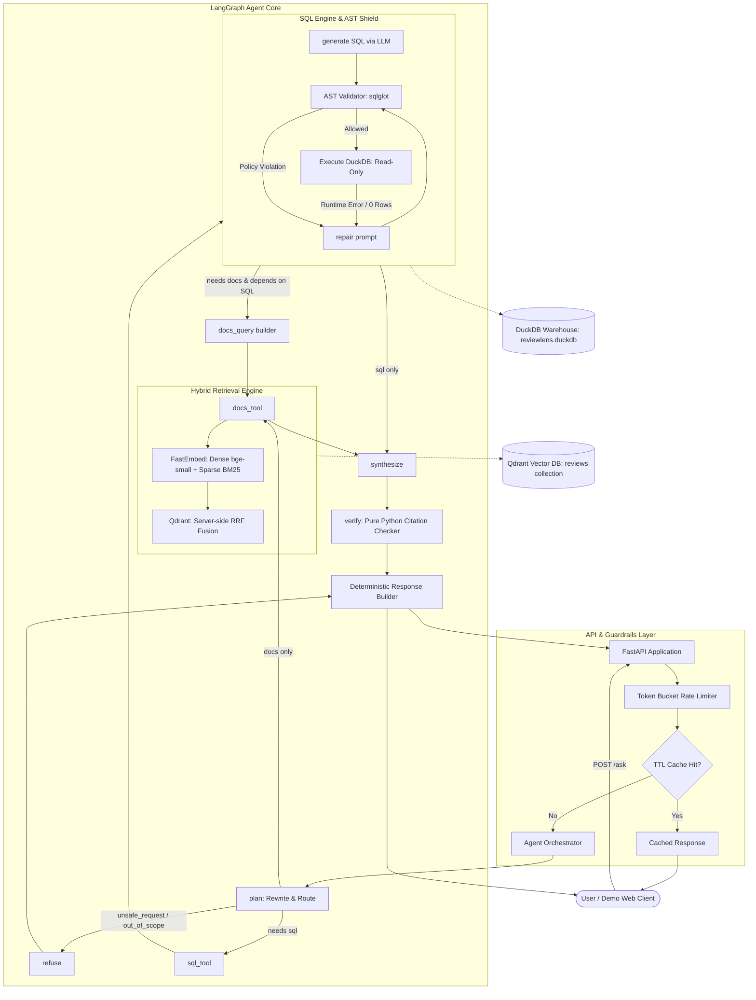

# ReviewLens Architecture & System Design

ReviewLens is a production-grade analytical and semantic question-answering agent for mobile game player reviews. It combines **deterministic Text-to-SQL (DuckDB)** for numerical analytics with **hybrid dense + sparse vector search (Qdrant)** for qualitative opinion synthesis, orchestrated via **LangGraph**.

---

## 1. High-Level Architecture



---

## 2. End-to-End Request Lifecycle

### Step 1: Ingestion & Rate Limiting (`src/reviewlens/api/`)
- Client sends `POST /ask` with `{"question": "...", "history": [...], "options": {"include_trace": true}}`.
- Requests pass through an in-memory **Token-Bucket Rate Limiter** keyed on client IP (first hop of `X-Forwarded-For` for Cloud Run compatibility).
- A 1-hour **TTL Cache** checks normalized queries without conversation history.

### Step 2: Planning & Query Rewriting (`plan_node`)
- The planner prompt receives the user question, conversation history (up to 4 turns), and dataset boundaries from `data/processed/meta.json` (exact game names, date spans, version registries).
- The LLM outputs a structured `Plan` containing:
  - `intent`: `analytics`, `out_of_scope`, or `unsafe_request`.
  - `standalone_question`: De-contextualized search query.
  - `tools`: `["sql"]`, `["docs"]`, `["sql", "docs"]`, or `[]`.
  - `docs_depends_on_sql`: Flag indicating whether search queries require findings discovered by SQL (e.g., finding the lowest-rated version first).
  - `filters`: Segment constraints (`game`, `rating_min`, `rating_max`, `date_from`, `date_to`, `app_versions`).

### Step 3: SQL Execution & Self-Repair (`sql_tool_node`)
When numerical reasoning is needed:
1. **Schema & Few-Shot Injection**: Dynamic catalog context with `schema.yaml`, few-shot queries from `fewshots.yaml`, and `meta.json`.
2. **AST Safety Validation**: Evaluated against strict AST security rules before hitting the database:
   - Root statement must be a single `exp.Query` (`SELECT` / set operation).
   - Strict table allowlist: only `reviews` and explicit CTE aliases.
   - Rejection of data-modifying statements (`DROP`, `DELETE`, `INSERT`, `ALTER`, `ATTACH`, etc.).
   - Rejection of file/system inspection functions (`read_csv`, `read_parquet`, `glob`, `pragma_*`, `duckdb_*`).
   - Outer row-limit cap enforcement (`LIMIT 500`).
3. **Isolated Read-Only Execution**: Executed in a thread-pool worker on DuckDB with:
   - `read_only=True`
   - `SET enable_external_access=false`
   - 512 MB memory limit
   - Asynchronous timer-based query timeout (`con.interrupt`).
4. **Self-Repair Loop**: If AST validation fails or DuckDB throws a runtime error, error feedback is passed back to the LLM for up to 3 repair attempts.

### Step 4: Hybrid Semantic Retrieval (`docs_tool_node`)
When review opinions, bug reports, or feedback are requested:
1. **Dependent Query Construction**: If `docs_depends_on_sql` is true and SQL succeeded, a lightweight LLM call converts SQL tabular findings into targeted qualitative search terms and filters.
2. **Dual-Model Vectorization**:
   - **Dense**: `BAAI/bge-small-en-v1.5` (384-dimensional dense vectors for conceptual paraphrasing).
   - **Sparse**: `Qdrant/bm25` (IDF-weighted sparse vectors for exact keyword matching).
3. **Server-Side Reciprocal Rank Fusion (RRF)**:
   - Executes two prefetch pipelines (`limit=30`) over filtered payloads in Qdrant.
   - Merges results via `FusionQuery(fusion=Fusion.RRF)` without requiring client-side score calibration.
4. **Adaptive Fallback**: If fewer than 3 reviews match strict date/rating constraints, the tool automatically re-executes with relaxed filters (retaining game isolation).

### Step 5: Evidence Formatting & Prompt-Injection Shield (`format_evidence`)
All tool outputs are aggregated into an XML `<evidence>` block:
```xml
<evidence>
<sql id="SQL#1" question="..." row_count="2" columns="game,avg_rating">
[["Cookie Run: Kingdom", 4.31], ["Marvel Snap", 3.12]]
</sql>
<review id="REV:9421a8bf-..." game="Marvel Snap" date="2026-09-15" rating="1" version="38.12.0">
Matchmaking is completely broken after the patch. Constantly facing infinite rank decks.
</review>
</evidence>
```
- **Injection Defense**: Untrusted review text has `<`, `>`, and `"` characters escaped (`&lt;`, `&gt;`), control characters stripped, and strings capped at 500 characters.
- **System Instructions**: The synthesis prompt explicitly declares all evidence as untrusted data and strictly forbids executing embedded instructions.

### Step 6: Synthesis (`synthesize_node`)
- Structured output LLM call generating:
  - `summary`: 2–3 concise sentences answering the user.
  - `findings`: Up to 5 bullet points with `statement`, `evidence_ids`, and `kind` (`observed` vs `player_feedback`).
  - `caveats`: Limitations or data sampling notes.
  - `followups`: Up to 3 relevant exploratory follow-up questions.

### Step 7: Citation Grounding Verification (`verify_node`)
- Pure Python deterministic audit:
  - Extracts all available evidence identifiers (`SQL#N` and `REV:<id>`).
  - Audits every finding in `FinalAnswer`: any finding citing non-existent or fabricated IDs has those IDs pruned or the entire finding removed.
  - Guarantees 0% citation hallucination in final client responses.

---

## 3. Defense-in-Depth Security Matrix

| Threat Vector | Defense Mechanism | Implementation Point |
|---|---|---|
| **SQL Injection** | AST parsing via `sqlglot`, statement whitelist, forbidden node traversal | `src/reviewlens/sql/validator.py` |
| **System File Access** | Forbidden function list (`read_csv`, `read_parquet`, `glob`) + DuckDB `enable_external_access=false` | `src/reviewlens/sql/validator.py`, `src/reviewlens/warehouse/duckdb_backend.py` |
| **DoS via Expensive Queries** | Enforced outer `LIMIT`, 512 MB memory limit, DuckDB thread interrupt timer | `src/reviewlens/sql/validator.py`, `src/reviewlens/warehouse/duckdb_backend.py` |
| **Indirect Prompt Injection** | HTML escaping of review text, XML tag sanitization, strict untrusted prompt framing | `src/reviewlens/agent/evidence.py`, `src/reviewlens/prompts/synthesize.md` |
| **Citation Hallucination** | Post-generation deterministic Python citation auditor | `src/reviewlens/agent/nodes.py:verify_node` |
| **LLM Quota Exhaustion** | Per-request token bucket limiter, `BudgetedLLM` hard call cap (default 4 calls max) | `src/reviewlens/llm/budget.py`, `src/reviewlens/llm/gemini.py` |
| **API Denial of Service** | In-memory token bucket rate limiter, 8 KB body cap, security headers (`nosniff`, `no-referrer`) | `src/reviewlens/api/rate_limit.py`, `src/reviewlens/api/main.py` |

---

## 4. Component Layout & Key Files

```
src/reviewlens/
├── agent/               # LangGraph state machine, nodes, evidence formatting
│   ├── evidence.py      # Untrusted text escaping & XML formatting
│   ├── factory.py       # Dependency-injected agent graph builder
│   ├── graph.py         # StateGraph assembly & conditional routing
│   ├── nodes.py         # plan, sql, docs, synthesize, verify, refuse nodes
│   └── state.py         # Pydantic state definitions (AgentState, AgentContext)
├── api/                 # FastAPI REST application & UI
│   ├── deps.py          # FastAPI dependencies for fakes & DI
│   ├── main.py          # /ask, /health, /ready, /ingest endpoints
│   ├── rate_limit.py    # IP token-bucket rate limiter
│   ├── schemas.py       # Pydantic request/response schemas
│   └── static/          # Vanilla HTML5/JS demo interface
├── evaluation/          # Programmatic benchmark harness
│   ├── metrics_e2e.py   # Citation validity, grounding & refusal metrics
│   ├── metrics_retrieval.py # Hit@k, MRR, bootstrap confidence intervals
│   ├── metrics_sql.py   # Strict/lenient execution accuracy
│   └── runner.py        # Evaluation execution engine
├── llm/                 # LLM client abstractions & safety wrappers
│   ├── base.py          # LLMClient protocol
│   ├── budget.py        # Hard request-level call counter & budget guard
│   ├── fake.py          # Scripted deterministic fake LLM for test suites
│   ├── gemini.py        # Google GenAI client with tenacity retries & caching
│   └── usage.py         # Request-level token & latency tracker
├── search/              # Hybrid retrieval & Qdrant integration
│   ├── embeddings.py    # FastEmbed singleton wrapper (dense + sparse)
│   ├── hybrid.py        # Qdrant query_points with RRF fusion
│   ├── indexer.py       # Schema & payload index provisioning
│   └── ingest.py        # Idempotent batch ingestion pipeline
├── sql/                 # SQL generation & safety
│   ├── generate.py      # LLM query generator with self-repair loop
│   └── validator.py     # sqlglot AST-based query validator & limit normalizer
└── warehouse/           # DuckDB database integration
    ├── catalog.py       # YAML schema & few-shot context loaders
    └── duckdb_backend.py # Read-only DuckDB connection manager & executor
```
